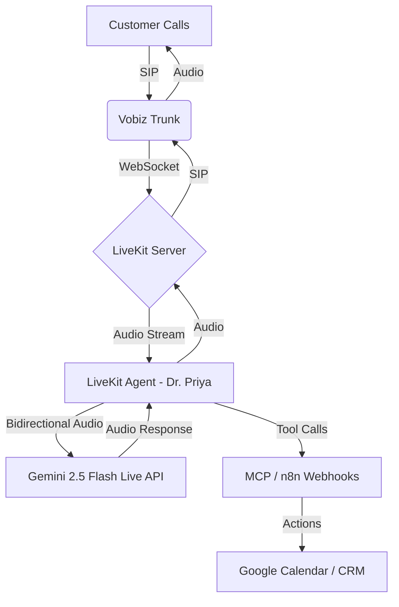

# 🚀 LIVEKIT + GEMINI 2.5 LIVE + MCP DEPLOYMENT GUIDE

## ✅ What Has Been Built
I have created the core **LiveKit Agent** file (`src/livekit_agent_mcp.py`) that connects:
1.  **Vobiz** (Telephony via SIP)
2.  **LiveKit** (Real-time Media Server)
3.  **Gemini 2.5 Flash Live** (Multimodal AI: STT+LLM+TTS in one)
4.  **MCP Tools** (Booking, Calendar, Human Transfer)

---

## 🏗️ Architecture Overview



---

## 📋 STEP-BY-STEP DEPLOYMENT

### Phase 1: Prerequisites & Accounts (15 mins)

1.  **LiveKit Cloud Account**:
    *   Go to [cloud.livekit.io](https://cloud.livekit.io)
    *   Create a new Project (e.g., `vobiz-dental-india`).
    *   Copy `LIVEKIT_API_KEY`, `LIVEKIT_API_SECRET`, and `LIVEKIT_URL`.

2.  **Google Cloud (Gemini)**:
    *   Go to [Google AI Studio](https://aistudio.google.com/app/apikey).
    *   Create an API Key.
    *   Ensure **Gemini 2.5 Flash Preview** access is enabled.

3.  **Vobiz Account**:
    *   Login to [vobiz.ai](https://vobiz.ai).
    *   Buy a DID (Phone Number) for India.
    *   Get SIP Credentials (Username, Password, Host).

4.  **n8n (Optional for now, required for tools)**:
    *   Setup n8n (cloud or self-hosted).
    *   Create a webhook for "Book Appointment".

---

### Phase 2: Environment Setup

Create a `.env` file in the root directory:

```bash
# LiveKit Configuration
LIVEKIT_URL=wss://your-project.livekit.cloud
LIVEKIT_API_KEY=your_livekit_api_key
LIVEKIT_API_SECRET=your_livekit_api_secret

# Google Gemini Configuration
GEMINI_API_KEY=your_google_ai_studio_key

# Vobiz Configuration (Used in LiveKit Dashboard later)
VOBIZ_SIP_HOST=sip.vobiz.ai
VOBIZ_SIP_USERNAME=your_vobiz_sip_user
VOBIZ_SIP_PASSWORD=your_vobiz_sip_pass
VOBIZ_SIP_PORT=5060

# Business Logic
CLINIC_NAME="Smile Care Dental Clinic"
RECEPTIONIST_NUMBER="+919876543210"
N8N_WEBHOOK_URL="https://n8n.yourdomain.com/webhook/book-appointment"
```

---

### Phase 3: Install Dependencies

```bash
cd /workspace/vobiz-voice-ai

# Create virtual environment
python -m venv venv
source venv/bin/activate  # On Windows: venv\Scripts\activate

# Install requirements
pip install -r requirements.txt
# Note: Ensure 'livekit-agents', 'google-genai', and 'protobuf' are in requirements.txt
```

**Update `requirements.txt` with these specific lines:**
```text
livekit-agents>=0.10.0
google-genai>=0.1.0
python-dotenv
```

---

### Phase 4: Configure LiveKit SIP Trunk (Crucial Step)

You must tell LiveKit how to talk to Vobiz.

1.  Go to **LiveKit Cloud Dashboard** -> Your Project -> **SIP Trunks**.
2.  Click **Add Inbound Trunk**:
    *   **Name**: `Vobiz-Inbound`
    *   **Allowed Addresses**: Add Vobiz SIP IPs (check Vobiz docs, usually `sip.vobiz.ai` or their specific IP range).
    *   **Authentication**: None (if IP based) or Username/Pass if Vobiz provides specific auth for inbound.
3.  Click **Add Outbound Trunk**:
    *   **Name**: `Vobiz-Outbound`
    *   **Address**: `sip.vobiz.ai`
    *   **Port**: `5060`
    *   **Username**: `YOUR_VOBIZ_SIP_USER`
    *   **Password**: `YOUR_VOBIZ_SIP_PASS`
    *   **Transport**: UDP/TCP (as per Vobiz).

4.  **Create Dispatch Rule**:
    *   Go to **SIP Dispatch Rules**.
    *   **Rule**: If call comes to `[Your Phone Number]`, join room `dental-agent-room`.
    *   **Agent**: Select your deployed agent (we will run this locally first, then deploy).

---

### Phase 5: Run the Agent Locally (Testing)

Run the agent code we just created:

```bash
python -m src.livekit_agent_mcp start
```

*Wait for output:* `Worker registered, waiting for jobs...`

**Test the flow:**
1.  Call your Vobiz phone number from your mobile.
2.  Vobiz routes to LiveKit.
3.  LiveKit creates a room and invites your Agent.
4.  Agent connects to Gemini 2.5 Live.
5.  **You should hear:** "Namaste! Main Dr. Priya bol rahi hoon..."

---

### Phase 6: Connecting MCP Tools (Advanced)

The current code has *simulated* tools. To make them real using MCP:

1.  **Setup an MCP Server**:
    You can use `n8n` as a tool server or write a simple Python MCP server.
    
    *Example `mcp_server.py` (Conceptual):*
    ```python
    from mcp.server import Server
    from mcp.server.stdio import stdio_server
    
    app = Server("dental-tools")
    
    @app.tool()
    async def book_appointment(date: str, time: str, name: str):
        # Call n8n webhook here
        return {"status": "booked", "id": "123"}
    ```

2.  **Update Agent to connect to MCP**:
    Modify `src/livekit_agent_mcp.py` to use the `livekit.plugins.mcp` (when available) or standard HTTP calls to your tool server.
    
    *For now, the code uses direct HTTP requests to n8n webhooks which is faster for MVP.*

---

## 🐛 Troubleshooting

| Issue | Solution |
|-------|----------|
| **"Module not found: livekit"** | Run `pip install livekit-agents` inside venv. |
| **No Audio / Silence** | Check Gemini API Key quota. Ensure `response_modalities=["AUDIO"]` is set. |
| **Call drops immediately** | Check LiveKit SIP Trunk IP allowlist. Verify Vobiz credentials. |
| **Latency > 1s** | Ensure server is in Mumbai (ap-south-1). Use Gemini 2.5 Flash (not Pro). |
| **Hindi not working** | Explicitly prompt: "Reply in Hindi if user speaks Hindi". Gemini 2.5 is good at auto-detecting. |

---

## 📈 Next Steps to Production

1.  **Deploy Agent**: Use Docker to deploy `src/livekit_agent_mcp.py` to AWS Mumbai or DigitalOcean Bangalore.
2.  **Monitor Costs**: Set up alerts on Google Cloud Console for Gemini API usage.
3.  **Refine Persona**: Test with 10 different Hindi/English accents. Adjust system prompt.
4.  **Sales**: Record a demo call and send it to 20 dental clinics in Delhi/Mumbai.

**Jai Hind! Ready to launch? 🇮🇳🚀**
